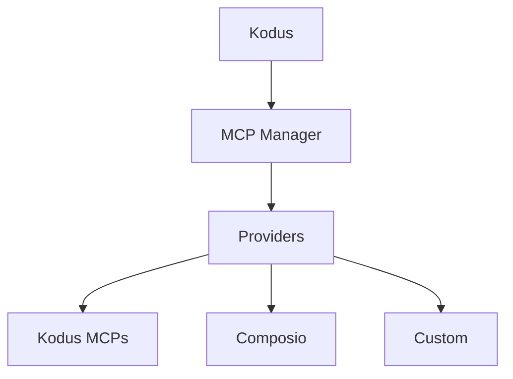

## What are MCPs?

Model Context Protocol (MCP) is an open standard that lets LLM apps connect to
external tools and data sources through a consistent server interface. MCP
servers publish tool schemas and endpoints so clients like Kodus/Kody can fetch
context or run actions during a workflow.

## MCP Manager Architecture

MCP Manager is the backend service that brokers those MCP connections for
Kodus. It keeps track of providers, integrations, and allowed tools per
workspace, then exposes that catalog to the Kodus API.

- Central registry for MCP providers (Kodus, Composio, and custom)
- Stores integration metadata (connection status, MCP URL, allowed tools)
- Handles provider-specific authentication flows and tool discovery
- Exposes APIs used by Kodus to list and invoke MCP tools

## Plugins in Kodus

Everything registered in MCP Manager appears in the Kodus **Plugins** screen,
so your team can install, manage, and enable the MCPs available for each
workspace.

## Providers

### Kodus provider

The Kodus provider bundles first-party MCPs managed by Kodus, including the
Kodus MCP, Context7 MCP, and Kodus Docs MCP.

### Composio provider

Composio is a managed integration platform with a large catalog of SaaS tools.
MCP Manager uses Composio for authentication and to provision MCP endpoints
that Kodus can call. See the official docs for setup details:
[Composio MCP docs](https://docs.composio.dev/docs/mcp-providers)

### Custom providers

You can add custom providers to integrate internal systems or third-party
platforms. In self-hosted deployments, list the provider in
`API_MCP_MANAGER_MCP_PROVIDERS`, then implement the provider in the MCP Manager
codebase. The reference implementation lives here:
[kodus-mcp-manager repo](https://github.com/kodustech/kodus-mcp-manager#-adding-a-new-provider)

## Configuring Composio

1. Create a Composio account and an integration for the tool you want to
   expose.
2. Enable or create an MCP server for that integration (see Composio docs).
3. Set these variables in your Kodus `.env`:
   - `API_MCP_MANAGER_COMPOSIO_API_KEY`
   - `API_MCP_MANAGER_COMPOSIO_BASE_URL` (default:
     `https://backend.composio.dev/api/v3`)
4. Ensure `composio` is listed in `API_MCP_MANAGER_MCP_PROVIDERS`.
