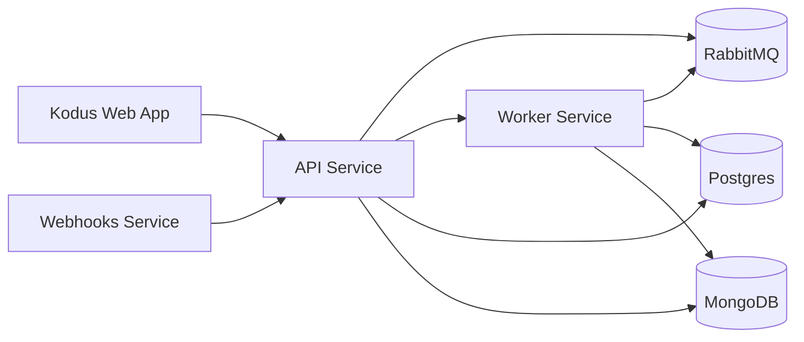

## Overview

This document outlines the architecture powering Kodus's infrastructure. Our system is built on a distributed architecture that leverages containerization and network segmentation to ensure maximum scalability, security, and maintainability.

## Networks and Key Components

The infrastructure is divided into Docker networks that separate public access
from internal service traffic:

- shared-network: Public-facing services and edge routing
- kodus-backend-services: Internal service-to-service communication
- monitoring-network: Metrics and observability traffic (optional)

## Components

### 1. Kodus Web Application

Our frontend platform is built with Next.js, delivering a seamless user experience through direct communication with our API layer.

### 2. Core Backend Services

The 2.0 stack splits backend responsibilities into dedicated services:

- API: Central service layer handling business logic and request processing
- Worker: Asynchronous processing for queues and background jobs
- Webhooks: Dedicated service for Git provider webhooks

### 3. MCP Manager

MCP Manager catalogs providers and integrations, then exposes them to Kodus so
teams can install MCPs from the Plugins screen.

### 4. Data Stores

Kodus uses two databases:

- Postgres: Relational data and embeddings metadata
- MongoDB: Flexible document storage

### 5. Messaging and Observability

RabbitMQ is required for 2.0, providing reliable asynchronous communication
between API, worker, and webhooks.

Prometheus and Grafana are optional and used for monitoring and visualization.

### 6. Auxiliary Services (Kodus Cloud)

Kodus Cloud includes closed-source auxiliary services (billing, analytics, and
chat integrations) that are not required for self-hosted deployments.

## Next Steps
<CardGroup cols={2}>
  <Card title="Run Kodus Locally" icon="laptop" href="/how_to_deploy/en/local_quickstart/orchestrator">
    Ideal for local development and getting familiar with the full Kodus stack.
  </Card>
  <Card title="Deploy Kodus to Production" icon="rocket" href="/how_to_deploy/en/deploy_kodus/generic_vm">
    Perfect for production deployment and experiencing the full capabilities of Kodus.
  </Card>
</CardGroup>
