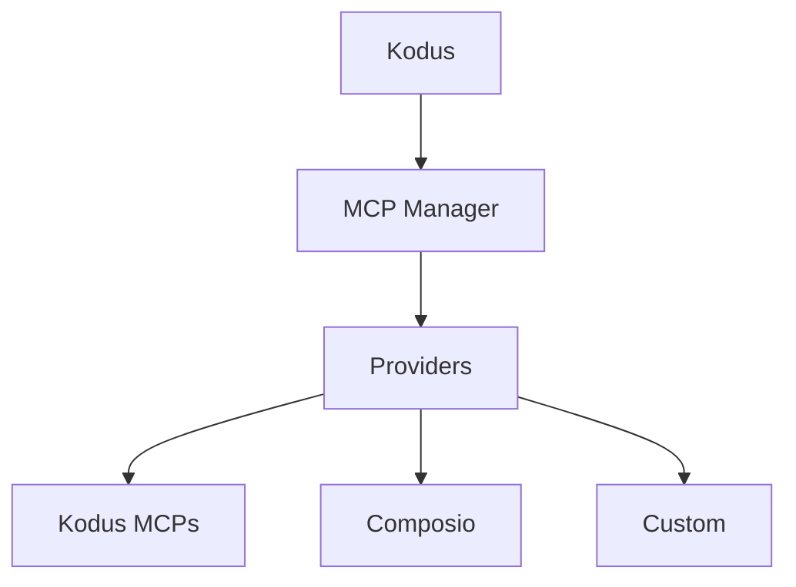

## 什么是 MCP？

Model Context Protocol (MCP) 是一个开放标准，允许 LLM 应用程序通过一致的服务器接口连接到外部工具和数据源。MCP 服务器发布工具架构和端点，以便像 Kodus/Kody 这样的客户端可以在工作流程期间获取上下文或运行操作。

## MCP Manager 架构

MCP Manager 是为 Kodus 中介这些 MCP 连接的后端服务。它跟踪提供商、集成和每个工作区允许的工具，然后将该目录暴露给 Kodus API。

- MCP 提供商的中央注册表（Kodus、Composio 和自定义）
- 存储集成元数据（连接状态、MCP URL、允许的工具）
- 处理特定于提供商的身份验证流程和工具发现
- 公开 Kodus 用于列出和调用 MCP 工具的 API

## Kodus 中的插件

在 MCP Manager 中注册的所有内容都显示在 Kodus **插件**屏幕中，因此您的团队可以安装、管理和启用每个工作区可用的 MCP。

## 提供商

### Kodus 提供商

Kodus 提供商捆绑了由 Kodus 管理的第一方 MCP，包括 Kodus MCP、Context7 MCP 和 Kodus Docs MCP。

### Composio 提供商

Composio 是一个托管集成平台，拥有大量 SaaS 工具目录。MCP Manager 使用 Composio 进行身份验证并配置 MCP 端点，Kodus 可以调用这些端点。有关设置详情，请参阅官方文档：
[Composio MCP 文档](https://docs.composio.dev/docs/mcp-providers)

### 自定义提供商

您可以添加自定义提供商来集成内部系统或第三方平台。在自托管部署中，在 `API_MCP_MANAGER_MCP_PROVIDERS` 中列出提供商，然后在 MCP Manager 代码库中实现该提供商。参考实现位于：
[kodus-mcp-manager 仓库](https://github.com/kodustech/kodus-mcp-manager#-adding-a-new-provider)

## 配置 Composio

1. 创建一个 Composio 帐户和您想要公开的集成的集成。
2. 为该集成启用或创建 MCP 服务器（请参阅 Composio 文档）。
3. 在您的 Kodus `.env` 中设置这些变量：
   - `API_MCP_MANAGER_COMPOSIO_API_KEY`
   - `API_MCP_MANAGER_COMPOSIO_BASE_URL`（默认：
     `https://backend.composio.dev/api/v3`）
4. 确保 `composio` 列在 `API_MCP_MANAGER_MCP_PROVIDERS` 中。
