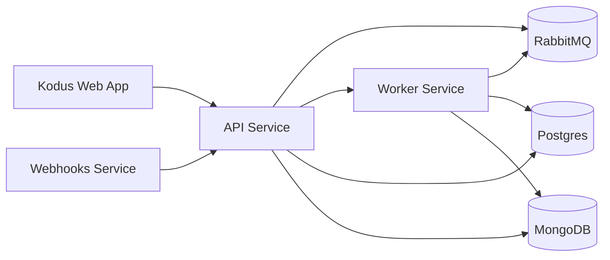

## 概述

本文档概述了支持 Kodus 基础设施的架构。我们的系统建立在分布式架构上，利用容器化和网络分段来确保最大的可扩展性、安全性和可维护性。

## 网络和关键组件

基础设施分为 Docker 网络，将公共访问与内部服务流量分开：

- shared-network: 面向公众的服务和边缘路由
- kodus-backend-services: 内部服务到服务的通信
- monitoring-network: 指标和可观测性流量（可选）

## 组件

### 1. Kodus Web 应用程序

我们的前端平台使用 Next.js 构建，通过与 API 层的直接通信提供无缝的用户体验。

### 2. 核心后端服务

2.0 堆栈将后端职责划分为专用服务：

- API: 处理业务逻辑和请求处理的中央服务层
- Worker: 用于队列和后台作业的异步处理
- Webhooks: 用于 Git 提供商 webhook 的专用服务

### 3. MCP Manager

MCP Manager 编目提供商和集成，然后将它们暴露给 Kodus，以便团队可以从插件屏幕安装 MCP。

### 4. 数据存储

Kodus 使用两个数据库：

- Postgres: 关系数据和嵌入元数据
- MongoDB: 灵活的文档存储

### 5. 消息传递和可观测性

2.0 需要 RabbitMQ，提供 API、worker 和 webhooks 之间可靠的异步通信。

Prometheus 和 Grafana 是可选的，用于监控和可视化。

### 6. 辅助服务 (Kodus Cloud)

Kodus Cloud 包括闭源辅助服务（计费、分析和聊天集成），这些服务不是自托管部署所必需的。

## 下一步
<CardGroup cols={2}>
  <Card title="本地运行 Kodus" icon="laptop" href="/how_to_deploy/zh/local_quickstart/orchestrator">
    非常适合本地开发和熟悉完整的 Kodus 堆栈。
  </Card>
  <Card title="将 Kodus 部署到生产环境" icon="rocket" href="/how_to_deploy/zh/deploy_kodus/generic_vm">
    非常适合生产部署和体验 Kodus 的全部功能。
  </Card>
</CardGroup>
